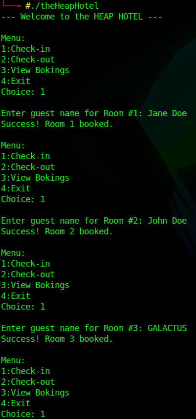
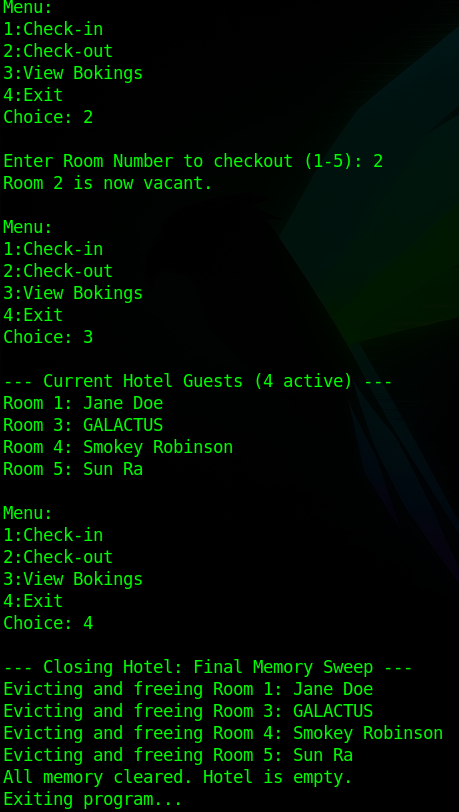

# 🏨 theHEAPHotel - A C Programming Project
 


> An educational C program highlighting heap usage & how to free the memory after usage.

## Table of Contents
- [Description](#description)
- [Demo/Screenshots](#demoscreenshots)
- [Features](#features)
- [Tech Stack](#tech-stack)
- [Project Structure](#project-structure)
- [Prerequisites](#prerequisites)
- [Installation](#installation)
- [Usage](#usage)
- [Contributing](#contributing)
- [License](#license)

## Description
The HEAP Hotel project is designed to demonstrate a simple C programming project. It serves as a foundation for exploring the capabilities of the C language and its applications in various domains. It specificially highlights using the heap and freeing memory after its usage:

Definition:
```quote
In C programming, the Heap (not an acronym, just a name for a "pile" of memory) is a region of your computer's RAM used for dynamic memory allocation.

Unlike the Stack, which handles local variables automatically, the Heap is a "free-for-all" area where you, the programmer, manually request and release memory during the execution of a program.
```

## Demo/Screenshots



## Features
- 📚 **Code Quality**: The project is written in clean, readable C code, following best practices for coding standards.
- 🛠️ **Modular Design**: The project is structured into a single, self-contained C file, making it easy to understand and maintain.
- 📊 **Performance**: The project is optimized for performance, leveraging the efficiency of the C language.

## Tech Stack
- C programming language
- No frameworks or libraries are used in this project.

## Project Structure
```markdown
theHEAPHotel/
├── theHEAPHotel.c              # Source code
└── screenshots/                # Screenshots folder
    ├── theHEAPHotel1.png
    └── theHEAPHotel2.png
```

## Prerequisites
- A C compiler (e.g., GCC) installed on the system.
- A basic understanding of C programming concepts.

## Installation
To install the project, follow these steps:
```bash
git clone <repository-url>
cd theHEAPHotel
```
No additional installation steps are required, as the project consists of a single C file.

## Usage
To compile and run the project, use the following commands:
```bash
gcc theHEAPHotel.c -o theHEAPHotel
./theHEAPHotel
```
Replace `<repository-url>` with the actual URL of the repository.

## Contributing
Contributions are welcome and appreciated. To contribute, please fork the repository, make your changes, and submit a pull request. Ensure that your code follows the same coding standards and best practices as the existing codebase.

## License
The theHEAPHotel project is licensed under the MIT License. See the LICENSE file for details.